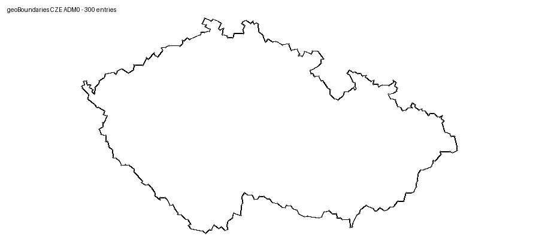

# ESP32 radar ČR + ADS-B + počasí

Firmware pro původní **Waveshare ESP32-S3-Touch-LCD-7** s displejem 800 × 480 px, řadičem ST7262 a kapacitním dotykem GT911. Na jedné obrazovce kombinuje animovaný meteorologický radar ČHMÚ, lokální ADS-B provoz, aktuální údaje osobní meteorologické stanice, předpověď počasí a astronomické údaje.

> **Aktuální verze:** `0.16.0-touch-map-zoom-nvs`  
> **Stav projektu:** vývojová verze určená pro praktické testování na originální desce Waveshare ESP32-S3-Touch-LCD-7. Není určena pro varianty 7B/7C bez úpravy ovladače.

English documentation: [README_EN.md](README_EN.md)



## Hlavní funkce

- animace posledních šesti pětiminutových radarových snímků ČHMÚ,
- detailní obrys České republiky z geoBoundaries, redukovaný na 300 bodů,
- zobrazení letadel z lokálního `dump1090`, `readsb` nebo `tar1090`,
- aktuální počasí z Weather Underground PWS,
- předpověď pro `+3`, `+6`, `+9`, `+12`, `+24` a `+48 hodin`,
- Open-Meteo jako hlavní zdroj předpovědi a WU/TWC jako záloha,
- výpočet východu a západu Slunce a Měsíce, výšky nad obzorem a fáze Měsíce,
- dotyková tlačítka `PAUZA/PLAY` a `OBNOVIT`,
- dotykové přepínání výřezu mapy,
- uložení posledního výřezu do NVS a automatické obnovení po restartu,
- dvojité mapové buffery a radarová cache v PSRAM pro plynulé překreslování,
- sériová diagnostika na 115200 baud.

## Dotykové ovládání mapy

Klepnutí kamkoliv do mapy přepíná výřez v tomto pořadí:

```text
celá ČR → 50 km → 25 km → 10 km → celá ČR
```

Při přiblížení se mapa vystředí na místo dotyku. Do trvalé paměti ESP32 se ukládá:

- režim výřezu,
- zeměpisná šířka středu,
- zeměpisná délka středu.

Zápis se provede s krátkým zpožděním, aby při rychlém klepání nevznikaly zbytečné zápisy do flash paměti.

## Podporovaný hardware

Projekt je připraven pro:

- Waveshare **ESP32-S3-Touch-LCD-7**, původní model,
- LCD 800 × 480, ST7262,
- dotyk GT911,
- IO expander CH422G,
- 8 MB flash,
- 8 MB OPI PSRAM.

Projekt není bez úprav určen pro modely označené **7B** nebo **7C**.

## Datové zdroje

| Zdroj | Použití | Výchozí interval |
|---|---|---:|
| ČHMÚ Open Data | radarový kompozit MAX_Z masked | 5 min |
| lokální `aircraft.json` | ADS-B poloha, kurz, výška, callsign | 2 s |
| Weather Underground PWS | aktuální údaje stanice | 5 min |
| Open-Meteo | hodinová předpověď do 48 h | 1 h |
| WU/TWC hourly | záložní předpověď | při selhání Open-Meteo |
| lokální astronomický výpočet | Slunce, Měsíc a fáze | 1 min |

## Rychlá instalace

### 1. Klonování repozitáře

```bash
git clone https://github.com/OK5TVR/esp32-radar-adsb-weather.git
cd esp32-radar-adsb-weather
```

Při jiném názvu repozitáře upravte adresu v příkazu.

### 2. Nastavení přístupových údajů

Zkopírujte vzorový soubor:

**Windows PowerShell**

```powershell
Copy-Item include/secrets.example.h include/secrets.h
```

**Linux/macOS**

```bash
cp include/secrets.example.h include/secrets.h
```

Potom upravte `include/secrets.h`:

```cpp
#define WIFI_SSID          "NAZEV_WIFI"
#define WIFI_PASSWORD      "HESLO_WIFI"
#define WU_API_KEY         "WEATHER_UNDERGROUND_API_KEY"
#define WU_STATION_ID      "IPLZE179"
#define ADSB_AIRCRAFT_URL  "http://192.168.1.100:8080/data/aircraft.json"
```

Soubor `include/secrets.h` je v `.gitignore` a nesmí být publikován.

### 3. Kompilace v PlatformIO

Otevřete kořenovou složku projektu ve VS Code s rozšířením PlatformIO a spusťte:

```bash
pio run -t clean
pio run -e waveshare-esp32-s3-touch-lcd-7
pio run -e waveshare-esp32-s3-touch-lcd-7 -t upload
pio device monitor -b 115200
```

Při prvním sestavení se stahuje připnutá platforma a knihovny, proto může build trvat déle.

## Samostatný test displeje a dotyku

Před nahráním celé aplikace lze sestavit jednoduchý test bez Wi-Fi:

```bash
pio run -e waveshare-display-test
pio run -e waveshare-display-test -t upload
```

Test ověří rozlišení, PSRAM a dotyk GT911.

## Struktura projektu

```text
include/config.h              rozměry, intervaly a geografické rozsahy
include/map_viewport.h        režimy výřezu mapy
include/models.h              datové struktury
include/secrets.example.h     vzor konfigurace bez hesel
src/radar_service.*           stažení a dekódování radarových PNG
src/adsb_service.*            načtení a parsování aircraft.json
src/weather_service.*         WU PWS, Open-Meteo a WU/TWC forecast
src/astronomy_service.*       Slunce, Měsíc a fáze
src/map_renderer.*            mapa, hranice, města a letadla
src/ui.*                      LVGL obrazovka a dotykové události
src/main.cpp                  inicializace, plánování a NVS
wiki/                         připravené stránky pro GitHub Wiki
```

## Dokumentace

Podrobná dokumentace je připravena ve složce [`wiki`](wiki/):

- [Instalace](wiki/Installation.md)
- [Konfigurace](wiki/Configuration.md)
- [Mapa a dotyk](wiki/Map-and-Touch.md)
- [Datové zdroje](wiki/Data-Sources.md)
- [Architektura](wiki/Architecture.md)
- [Řešení problémů](wiki/Troubleshooting.md)
- [Historie verzí](wiki/Release-History.md)

Postup publikace repozitáře a Wiki je v souboru [GITHUB_UPLOAD.md](GITHUB_UPLOAD.md).

## Bezpečnost

- Necommitujte `include/secrets.h`.
- HTTPS připojení v aktuální verzi používá `setInsecure()`; serverový certifikát se tedy nekontroluje.
- ADS-B URL bývá dostupná pouze v lokální síti.
- Před publikací vždy zkontrolujte změny příkazem `git status` a `git diff --cached`.

## Známá omezení

- firmware je cílený na jedinou konkrétní variantu displeje,
- mapový podklad neobsahuje běžné silnice ani terénní dlaždice,
- Weather Underground API klíč je nutný pro aktuální data PWS,
- Open-Meteo nevyžaduje API klíč a slouží primárně pro předpověď,
- po změně knihoven nebo platformy může být nutné smazat `.pio` a provést čistý build.

## Licence a zdroje

Licence zdrojového kódu zatím nebyla autorem určena. Před širším použitím nebo distribucí zvolte například MIT, Apache-2.0 nebo GPL-3.0 a přidejte odpovídající soubor `LICENSE`.

Použité datové a softwarové zdroje:

- ČHMÚ Open Data – radarový kompozit,
- geoBoundaries – hranice České republiky,
- Open-Meteo – předpověď počasí,
- Weather Underground / The Weather Company – PWS data a záložní forecast,
- LVGL, ArduinoJson, PNGdec a knihovny ESP32 Display Panel.

## Autor

**Tomáš Vlas, OK5TVR**
