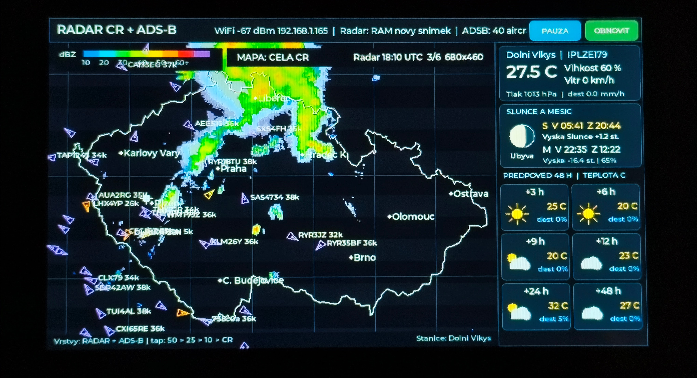

# Waveshare 7" Radar CR + ADS-B + pocasi

Firmware pro puvodni desku **Waveshare ESP32-S3-Touch-LCD-7**
(800 x 480, ST7262, GT911, CH422G, 8 MB OPI PSRAM).

Aktualni verze: **0.19.0-home-web-3alerts-layers**

> Projekt neni urcen pro varianty 7B/7C bez upravy ovladace displeje.



## Hlavni funkce

- animace radarovych snimku CHMI,
- lokalni ADS-B data z `aircraft.json`,
- aktualni pocasi z Weather Underground PWS,
- predpoved Open-Meteo pro +3, +6, +9, +12, +24 a +48 hodin,
- Slunce, Mesic a astronomicke udaje,
- dotykovy zoom mapy: cela CR, 50 km, 25 km a 10 km,
- ulozeni posledniho vyrezu mapy do NVS,
- runtime radarove aktualizace v PSRAM bez zapisu PNG do LittleFS,
- prvni nastaveni pres Wi-Fi AP,
- trvale dostupne webove nastaveni v domaci Wi-Fi,
- graficke zvyrazneni az tri letounu podle callsignu nebo ICAO hex,
- nezavisle zapinani radarove a ADS-B vrstvy.

## Prvni spusteni

Po prvnim nahrani firmware zarizeni vytvori konfiguracni pristupovy bod:

```text
SSID: Radar-ADSB-Setup-XXXX
Heslo: radarsetup
Adresa: http://192.168.4.1/
```

Postup:

1. Pripojte telefon nebo pocitac k siti `Radar-ADSB-Setup-XXXX`.
2. Otevrete `http://192.168.4.1/`.
3. Vyplnte domaci Wi-Fi, ADS-B URL a volitelne WU udaje.
4. Stisknete **Ulozit nastaveni**.
5. Zarizeni se restartuje a pripoji k domaci siti.

Pri chybe hesla nebo nedostupne siti se konfiguracni AP spusti znovu.

## Webove nastaveni v domaci siti

Webovy server zustava aktivni i po pripojeni k domaci Wi-Fi. IP adresa se
zobrazuje v horni liste displeje a v seriovem logu.

Priklad:

```text
http://192.168.1.123/
```

Pri funkcni podpore mDNS lze pouzit:

```text
http://radar-adsb.local/
```

Zmenu vrstev a sledovanych letounu lze ulozit bez restartu. Restart se provede
jen pri zmene SSID nebo zadani noveho hesla Wi-Fi.

> Web nema prihlaseni. Pouzivejte jej pouze v duveryhodne lokalni siti a
> nevystavujte port 80 do internetu.

## Vrstvy mapy

Ve webovem rozhrani jsou dva nezavisle prepinace:

- **Radarova vrstva**,
- **Letouny ADS-B**.

Dostupne kombinace:

```text
radar + ADS-B
jen radar
jen ADS-B
obe vrstvy vypnute
```

Volba se uklada do NVS a po restartu se obnovi. Datove zdroje se mohou dale
aktualizovat na pozadi, i kdyz je prislusna vrstva skryta; po opetovnem zapnuti
je proto vrstva ihned dostupna.

## Zvyrazneni tri letounu

Lze ulozit tri nezavisle identifikatory. Kazdy muze byt:

- callsign, napriklad `CSA123`,
- ICAO hex, napriklad `4B1812`.

Na webu je seznam aktualne zachycenych letounu a tlacitka pro vlozeni vybraneho
letounu do slotu 1, 2 nebo 3.

Zvyrazneni je pouze graficke:

- letoun 1: zvetseny symbol s ruzovym kruhem,
- letoun 2: zvetseny symbol s azurovym kruhem,
- letoun 3: zvetseny symbol se zlutym kruhem,
- bez zvuku a bez vyskakovaciho okna.

Pri vypnute ADS-B vrstve se letouny vcetne zvyraznenych symbolu nekresli.

## Ulozeni konfigurace

Do NVS se uklada:

- SSID a heslo Wi-Fi,
- URL `aircraft.json`,
- WU stanice a API klic,
- stav radarove a ADS-B vrstvy,
- zapnuti zvyrazneni,
- tri callsigny nebo ICAO identifikatory,
- posledni vyrez mapy.

Firmware automaticky prevede puvodni jeden sledovany letoun z verze 0.18.0 do
prvniho slotu.

## ADS-B zdroj

Vychozi priklad URL:

```text
http://192.168.1.170:8080/data/aircraft.json
```

ESP32 a ADS-B prijimac musi byt ve stejne siti nebo mezi jejich VLAN musi byt
povolena komunikace.

## Pocasi

- Weather Underground PWS poskytuje aktualni hodnoty vlastni stanice.
- Open-Meteo poskytuje predpoved a nevyzaduje API klic.
- Bez WU klice zustane aktualni PWS cast prazdna, predpoved Open-Meteo funguje.

## Stabilita RGB displeje

Prvni radarove soubory se stahuji pred inicializaci LCD. Po spusteni displeje
se nove radarove PNG stahuje do PSRAM a dekoduje primo do kompaktni radarove
vrstvy. Behem bezneho obnoveni se PNG nezapisuje do LittleFS.

Po ulozeni webove konfigurace nebo po radarove aktualizaci je naplanovana
jednorazova obnova RGB DMA pri nasledujicim VSYNC. PCLK se za behu nemeni.

## Kompilace

1. Otevrete celou slozku v PlatformIO.
2. Provedte **PlatformIO: Clean**.
3. Spustte **PlatformIO: Build**.
4. Spustte **PlatformIO: Upload**.
5. Serial Monitor nastavte na `115200 baud`.

Soubor `include/secrets.h` neni pro Wi-Fi potreba. Konfigurace se provadi pres
web. `include/secrets.example.h` lze pouzit jen pro volitelne compile-time
vychozi hodnoty WU a ADS-B.

## Diagnostika

Heartbeat obsahuje stav vrstev a tri alerty:

```text
HEARTBEAT ms=120000 WiFi=1 AP=0 heap=138 kB forecast=Open-Meteo cards=6 layers=R1/A1 alerts=on [CSA123|4B1812|RYR45]
```

Dulezite zpravy:

```text
Config web server: started on port 80 for AP and STA
Config web on home network: http://192.168.1.123/
Runtime web settings applied without restart
```

## API stavu

```text
http://IP_ZARIZENI/api/status
```

Vraci JSON s verzi firmware, Wi-Fi/AP, stavem obou vrstev a tremi sledovanymi
letouny vcetne informace, zda jsou prave zachyceni.

## Smazani konfigurace

Tlacitko **Smazat nastaveni** vymaze sitovou konfiguraci, datove zdroje,
vrstvy, sledovane letouny i ulozeny vyrez mapy. Po restartu se spusti prvotni
AP.

## Struktura projektu

```text
include/config.h             rozmery, intervaly a AP parametry
include/models.h             datove modely a tri alerty
include/settings_defaults.h  volitelne compile-time vychozi hodnoty
src/device_config.*          NVS, AP, STA web a konfigurace vrstev
src/adsb_service.*           nacteni aircraft.json
src/weather_service.*        WU a Open-Meteo
src/radar_service.*          CHMI radar a runtime aktualizace v PSRAM
src/map_renderer.*           mapa, vrstvy a zvyraznene symboly
src/ui.*                     LVGL obrazovka a dotyk
src/main.cpp                 inicializace a planovani uloh
```
